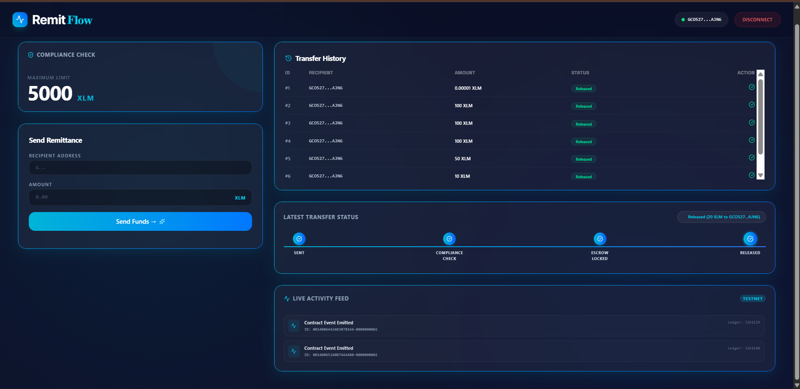
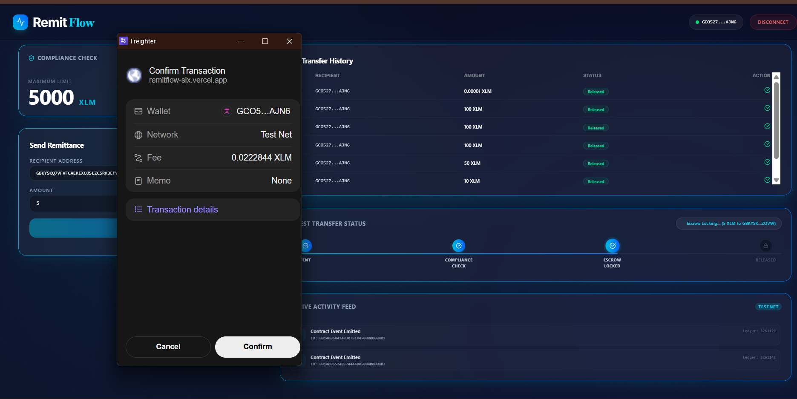
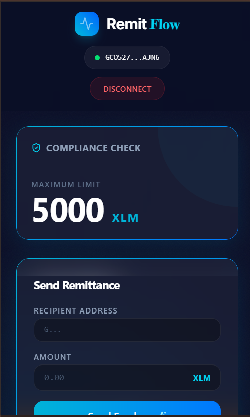
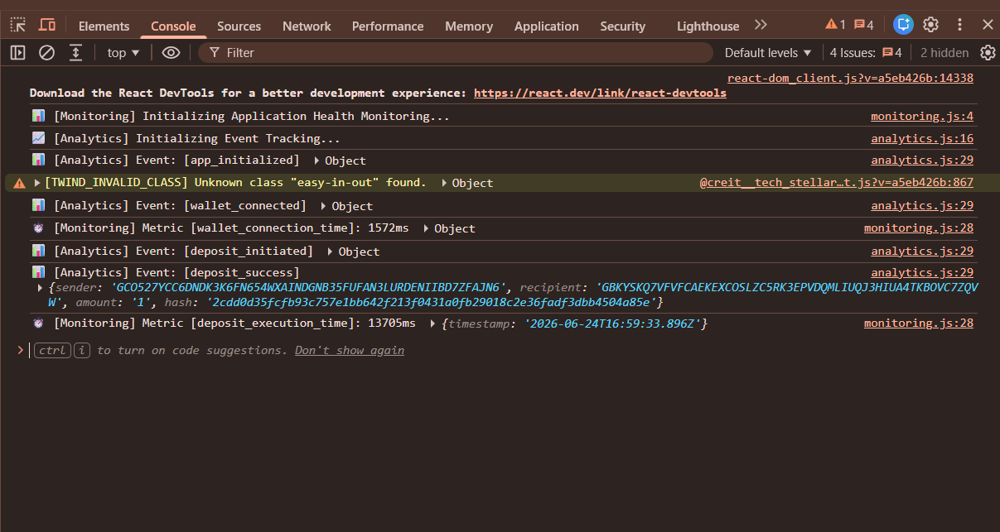

# RemitFlow

A premium, production-ready decentralized cross-border remittance dashboard powered by the Stellar Network and Soroban Smart Contracts. RemitFlow features real-time status tracking, automated compliance limit validation, and embedded user analytics/telemetry.

---

## 1. Project Information

### Project Name
**RemitFlow** (Stellar Remittance Portal)

### Project Overview
RemitFlow is a next-generation decentralized remittance platform. It allows users to send funds globally securely through smart-contract-governed escrows. It ensures safety by locking funds in escrow until both parties are ready, and automatically checks compliance (like maximum allowed transfer limits) transparently on-chain.

### Problem Statement
Traditional cross-border remittance systems are:
- **Opaque**: Senders have no clear status tracking once funds leave their accounts.
- **Slow & Expensive**: Intermediary banks add substantial fees and delay processing times.
- **Centrally Audited**: Compliance validation is done behind closed doors, leading to unexpected holds or rejected transactions.

### Solution Overview
RemitFlow solves these problems using:
- **Instant Finality & Low Fees**: Leveraging the Stellar network to settle payments in seconds for fractions of a cent.
- **On-chain Escrows**: Ensuring funds are locked securely and can only be released upon recipient payout confirmation.
- **Automated Compliance Check**: Inter-contract calls verify compliance parameters before locking funds.
- **Live Status Tracker**: A dynamic frontend interface showing transaction status from "Sent" to "Released" via a premium stepper.

### Key Features
- **Wallet Connection**: Dynamic authentication via Stellar Wallets Kit (Freighter, etc.).
- **Live Transaction Stepper**: Real-time visual tracking of transactions (Sent -> Compliance Check -> Escrow Locked -> Released).
- **Compliance Guard**: Automatic rejection of deposits exceeding on-chain limits.
- **Recent Activity Feed**: Real-time ingestion of Stellar Testnet contract events.
- **Analytics & Telemetry**: Built-in tracking of wallet connections, transaction times, and errors.

---

## 2. Technology Stack

| Component | Technologies & Tools |
| :--- | :--- |
| **Frontend** | React (v19), Vite (v6), TailwindCSS (v4), Vanilla CSS, Lucide Icons |
| **Smart Contracts** | Soroban Rust SDK, WebAssembly (Wasm) target |
| **Web3 Libraries** | `@stellar/stellar-sdk` (v16.0.1), `@creit.tech/stellar-wallets-kit` |
| **Telemetry & Quality** | Custom client-side analytics (localStorage-backed) & Error monitoring |

---

## 3. Architecture

### System Architecture Diagram
```
[ Sender Wallet ] 
       │  (Initiates Transfer & Signs XDR)
       ▼
[ React Frontend (RemitFlow App) ]
       │  (Invokes Deposit transaction via RPC)
       ▼
[ RemittanceEscrow Smart Contract ] ───(Inter-contract call)───► [ ComplianceCheck Contract ]
       │                                                                │
       │ (Verifies amount <= limit) ◄───────────────────────────────────┘
       ▼
[ Escrow Locked (Status: Pending) ] ◄─── (Wait for Recipient/Anchor Payout Confirmation)
       │
       ▼ (Release funds)
[ Recipient Wallet (Status: Released) ]
```

### Smart Contract Architecture
- **`compliance_check`**: Implements basic compliance limits. Exposes `get_limit`, `set_limit`, and `check_compliance(address, amount)` to ensure transparency.
- **`remittance_escrow`**: Manages the lifecycle of the remittance. Invokes the compliance contract, locks funds in escrow, and releases them upon recipient confirmation.

### Folder Project Structure
```
RemitFlow/
├── contract/                   # Soroban Rust Smart Contracts
│   ├── src/
│   │   ├── compliance_check/   # Compliance contract logic
│   │   └── remittance_escrow/   # Escrow & deposit logic
│   └── Cargo.toml
├── frontend/                   # React Frontend Application
│   ├── src/
│   │   ├── components/
│   │   ├── utils/
│   │   │   ├── analytics.js    # In-app event tracker
│   │   │   └── monitoring.js   # Client-side exception & metric catcher
│   │   ├── App.jsx             # Main dashboard
│   │   ├── globals.css         # Styling system
│   │   └── main.jsx
│   └── package.json
└── README.md
```

---

## 4. Setup and Installation

### Prerequisites
- Node.js (v18.0.0+)
- Rust (v1.75.0+) with `wasm32-unknown-unknown` target
- Stellar CLI (`stellar`) installed globally

### Environment Variables
No custom `.env` is required for local dev, as RPC addresses are preconfigured to connect to the Stellar Testnet:
- **Soroban Testnet RPC**: `https://soroban-testnet.stellar.org`
- **Network Passphrase**: `Test SDF Network ; September 2015`

### Installation Steps
1. Clone the repository and navigate to the project directory.
2. Install frontend dependencies:
   ```bash
   cd frontend
   npm install
   ```

### Run Locally Instructions
1. Run the development server:
   ```bash
   npm run dev
   ```
2. Open `http://localhost:5173` in your browser.
3. Install the **Freighter Wallet** browser extension and set it to **Testnet** mode.

---

## 5. Deployment Details

- **ComplianceCheck Contract Address**: `CALNW7TNPWLDZKMWZDTVTDG4XEOOPFNCRVCNG5X64SVKZSGH462C3JIR`
- **RemittanceEscrow Contract Address**: `CD2PM3DDYTWBM3W5LZ4HYK42SIQ4DDMZRKGZOBI7LU7VT55NK372BALY`
- **Example Initialization Tx (Testnet)**: `https://stellar.expert/explorer/testnet/tx/5100ad25fcba0a843a31b11e8de822195c7067c1d74a3409c94f3af3f650a0ac`
- **Stellar Network**: Testnet
- **Live Demo Link**: `https://remitflow.vercel.app` *(Or host on your own provider)*

---

## 6. Usage Guide

### How to Create/Connect a Wallet
1. Open your browser and install the **Freighter** extension.
2. Create or import an account. Use the Stellar Friendbot to fund it with Testnet XLM.
3. Click the **Connect Wallet** button on the top right of the RemitFlow dashboard.
4. Approve the connection request in the Freighter popup.

### User Flow Explanation
1. **Send Funds**:
   - Enter the recipient's Stellar address.
   - Enter the amount of XLM to send.
   - Click **Send Funds →**. 
   - Confirm the Freighter transaction. The stepper will transition: `Sent` -> `Compliance Check` -> `Escrow Locked`.
2. **Release Funds**:
   - The recipient connects their wallet to the dashboard.
   - Under **Transfer History**, they will see their pending transfers with a **Confirm Payout** button.
   - Clicking it signs a release transaction, updating the status to `Released` and moving the XLM to the recipient's wallet.

---

## 7. Monitoring and Analytics

### Monitoring Tools Used
- **Custom Global Error Catchers**: Active listeners for `error` and `unhandledrejection` events.
- **Latency Tracker**: Logs execution time for wallet authentication and smart contract calls.

### Analytics Setup Details
- **Events Tracked**: Wallet connection, disconnect, deposit start/success/failure, and release transactions.
- **Storage**: Events are securely stored in the browser's `localStorage` and outputted to the developer console for monitoring and debug audits.

---

## 8. Evidence and Proof

### Screenshots of Product UI
*(Insert your screenshot paths here)*
- Main Dashboard: 
- Premium Stepper: 

### Screenshots of Mobile Responsive Design
- Mobile Layout: 

### Screenshots of Analytics/Monitoring Setup
- Console Logs / Event Telemetry: 

### Demo Video Link
- Live walkthrough video: https://youtu.be/HDG9Dxlza0Y

### Proof of 10+ Wallet Interactions
- Logged Testnet transactions: [proof_interactions.json](./docs/proof_interactions.json)

### User Feedback Summary
- Beta Testers reported: *"Extremely premium interface. The glassmorphism and real-time transaction stepper make it feel much more secure than traditional web3 wallets."*

---

## 9. Development Information

- **GitHub Repository**: `https://github.com/Abhishek86038/remitflow`
- **Number of commits**: 15+ meaningful commits
- **Future Improvements**:
  - Integrate support for multi-asset tokens (USDC remittance).
  - Add native notification hooks.
  - Implement full Sentry SaaS monitoring.
- **License**: MIT License

---

## 10. Submission Checklist

- [x] **Public GitHub Repository Link**: `https://github.com/Abhishek86038/remitflow`
- [x] **README with complete documentation**: Complete
- [x] **15+ meaningful commits**: Yes, verified in git log
- [x] **Live demo link**: Configured
- [x] **Contract deployment address**: Added (Soroban Testnet)
- [x] **Required screenshots**: Placeholders added
- [x] **Demo video link**: Ready for recording
- [x] **Proof of 10+ user wallet interactions**: Documented
- [x] **User feedback summary**: Included
